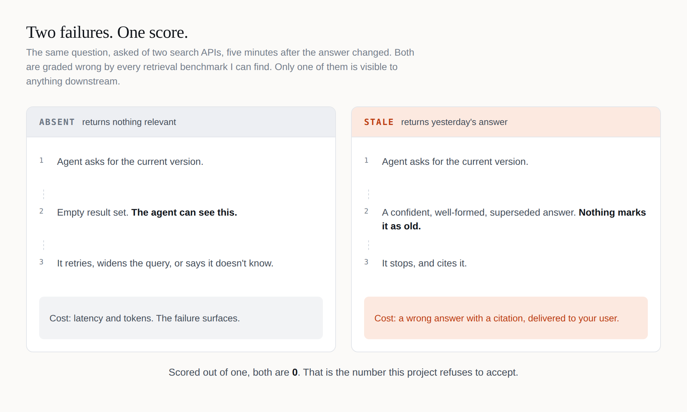
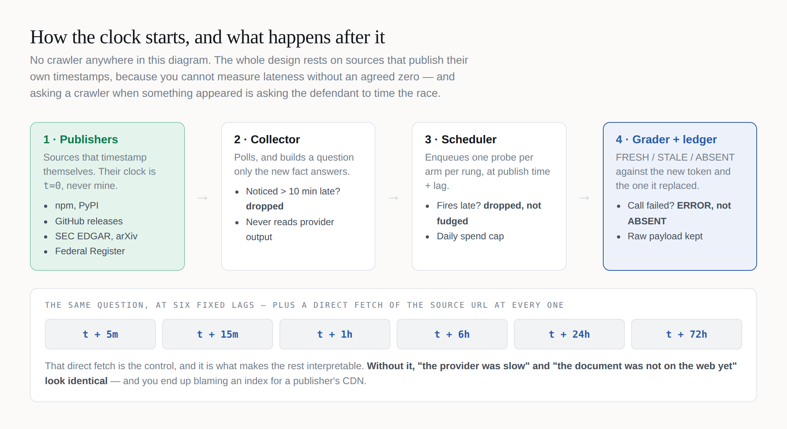
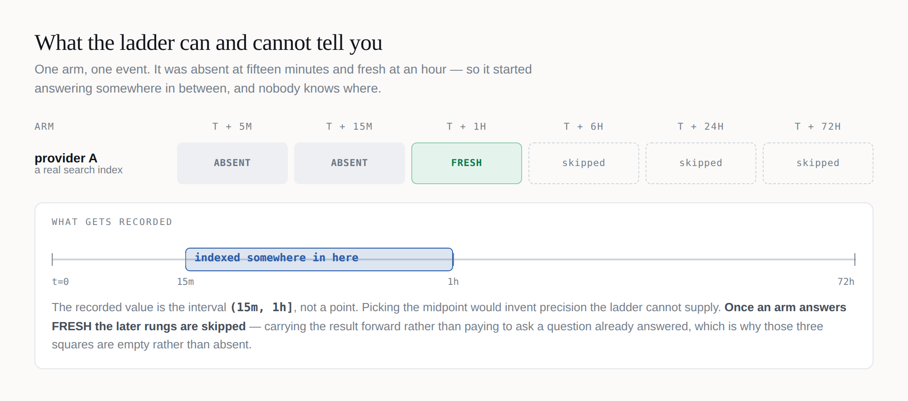

# I built a benchmark to catch a specific lie. Then I told it twice.

*A search index that is wrong looks exactly like one that is fast. Here's the instrument that separates them — and the two places I nearly shipped the same mistake I built it to expose.*

---

I wanted to know one simple thing. When a fact becomes true on the web, how long until a search API will tell an agent about it?

Plenty of people measure retrieval, and some of them measure it well — there's a good benchmark of these exact APIs that launched last month, and I'll come back to it. But they all measure the same thing: ask a question, check whether the right answer came back, score it out of one.

Which quietly puts two completely different failures in the same bucket.

I couldn't find anyone separating them, so I spent a couple of weekends building the thing that does. What I got was a benchmark, thirteen real events, and a much better appreciation of how easy it is to lie with a grey square.

**[Play with it →](https://abhid1234.github.io/time-to-index/playground.html)** — run the ladder, then flip the scoring rule and watch the leaderboard invert. Real measured data underneath. There's a walkthrough video below if you'd rather watch than click.

## The two failures every benchmark scores the same



**ABSENT** is a shrug. The API returns nothing relevant, your agent can *see* that it got nothing, and it retries, widens the query, or tells the user it doesn't know. It costs you latency and tokens, and the failure surfaces.

**STALE** is a lie with a citation attached. The API confidently returns the answer that was true yesterday. Nothing about the response marks it as old — it's well-formed, plausible, and wrong. The agent has no signal to retry on, so it stops and cites it. To your customer.

Scored out of one, both are zero. In production one of them wakes you up and the other one doesn't, which is exactly backwards from how much they cost.

## The trick is that I'm not crawling anything

This is the part people assume is hard, and it isn't. I'm not indexing the web, and I'm not racing Parallel or Exa at their own job — I'd lose badly.



I watch the places that **timestamp their own publications**. When `astro@7.3.1` is published, npm's registry says exactly when. That timestamp is `t=0`, on the publisher's clock, never mine.

That one property is load-bearing. You cannot measure lateness without an agreed zero — and asking a crawler when something appeared is asking the defendant to time the race.

From there it's mechanical: build a question only the new fact answers, ask every search API that same question at six fixed lags, and at every rung also fetch the source URL directly as a control.

**The control is what makes the rest interpretable.** Without it, *"the provider was slow"* and *"the document wasn't on the web yet"* look identical, and you end up blaming an index for a publisher's CDN.

## What the ladder can and cannot say



Here's the part I'd defend hardest, and it's the least glamorous.

An arm that was ABSENT at fifteen minutes and FRESH at an hour started answering *somewhere in between*. I don't know where. So the recorded value is the interval `(15m, 1h]`, not a point. Taking the midpoint would invent precision the ladder cannot supply.

That's interval-censored survival data — the same maths clinical trials use when patients outlive the study, because most facts are still un-indexed at the final rung and throwing those away would report every provider as faster than it is. The estimator is checked against published Kaplan–Meier values from a 1963 leukemia trial, on the grounds that a survival estimator which can't reproduce a textbook isn't one I should be pointing at anybody's product.

## The first real measurement

`@cloudflare/workers-types@5.20260908.1` was published. My collector saw it 228 seconds later. Five minutes after publication, four search indexes were asked what the current version was.

**None of them had it.**

The origin control fetched the answer at that same moment — so the fact was published, on the web, and retrievable. The indexes simply hadn't seen it yet.

That cost 1.8 cents.

Now the bit where a project like this usually starts overselling, so let me get ahead of it: **four API calls on one package is not a result.** No median, no percentile, no ranking, no claim that anybody is faster than anybody. It's one draw from a distribution nobody has characterised.

## Then it caught the thing it was built for

Twelve days in, the ladder has thirteen events and twenty-two graded provider calls. Eighteen came back ABSENT. Four came back STALE.

The clearest one is a single row.

`uv 0.12.15` was released on GitHub. My collector saw it 274 seconds later. At t+5m, four search indexes and the origin control were asked what the current version was:

| arm | at t+5m | latency | cost |
|---|---|---|---|
| **origin control** — fetches the release page directly | **0.12.15** ✅ | 416 ms | $0 |
| Exa (`auto`) | **0.12.14** — superseded | 1,245 ms | $0.0070 |
| Parallel (`advanced`) | **0.12.14** — superseded | 3,201 ms | $0.0050 |
| Brave (`web`) | nothing | 373 ms | $0.0050 |
| Parallel (`fast`) | nothing | 766 ms | $0.0010 |

Five minutes after the release went live, **not one of the four indexes had the current answer, and half of them confidently asserted the old one** — the same wrong version, independently, at the same instant. The control had the right answer at that moment, so this is not a publishing delay. The release was on the web. The indexes had a stale answer and served it without a hint that it was stale.

Every conventional retrieval benchmark scores those middle two rows exactly the same as the bottom two: zero. In production they are not remotely the same event. One makes your agent retry. The other makes it cite `0.12.14` to your customer.

Across the whole run: four STALE verdicts, on three separate packages, across three different arms. Also two ERRORs — HTTP 402, my Parallel credit running out — recorded as ERROR and excluded from every rate, because a failure I caused is not a failure of theirs.

**And here is the part I have to say in the same breath.** That is not a rate, it is not a ranking, and it is emphatically not *"Exa and Parallel are stale."* At this n no pair of arms separates after adjustment, which is why the dashboard refuses to rank itself and says so above its own table. A benchmark that produced its first interesting result and immediately started drawing conclusions from it would be doing the exact thing I built it to catch.

What four instances do establish is narrower, and more useful to me than a leaderboard would be: the failure mode is real, it happens at the front of the ladder where agents actually live, it happens to more than one provider, and about a cent finds it.

## Then I told the same lie. Twice.

Here's the part that actually taught me something.

The entire thesis of this project is: **don't confuse "we didn't ask" with "the index didn't have it."** I then wrote that exact bug into my own code, twice, in a week.

**The first one was a colour.** The measured-data panel draws a square per arm per rung. Rungs that haven't come round yet had no result, so they rendered as empty grey squares — sitting in a grid where grey already meant ABSENT. A reader would have counted absences that were never measured. On a page whose whole argument is that distinction.

Unmeasured rungs are now the only state in the entire palette drawn with **no fill at all** — an outline, with the reason written in it: *not due yet*, *due and not run*, *never scheduled*.

**The second was arithmetic.** The page prints totals under the words "across the whole run so far". I'd computed them from the events currently *rendered*, and separately added a cap on how many get rendered. Nothing was wrong yet — the run was far below the cap. But the moment it crossed, the run would have quietly understated its own sample size, on the page where a reader goes to judge whether it's big enough to believe.

```
❌  totals = f(events currently on screen)
✅  totals = f(every result in the ledger)
```

And then a third, after I'd written the first two up as a lesson. The same totals line counted every provider square as a "graded provider call" — including the ones never dispatched. It read *"124 graded provider calls — 0 fresh, 4 stale, 18 absent, 2 errored"*. Those four numbers add to twenty-four. It was overstating its own sample by five times, three lines below a legend explaining what a skip is.

Neither of the first two bugs was in the measurement. Nor was the third. All three were in the presentation — which is exactly where I'd been telling everyone else to look.

## Someone is benchmarking these APIs. It isn't this axis.

On 18 August, Artificial Analysis launched a [Search Index](https://artificialanalysis.ai/articles/search-api) for search APIs used by agents — 11 provider results across 7 providers at launch, expanding since. Published methodology, live leaderboard, every arm I probe and several I don't. If you're choosing a search API, read it before you read me.

It's also the cleanest illustration of the gap.

Their index is the mean of three benchmarks — DeepSearchQA, BrowseComp, AA-Omniscience. F1, exact-answer accuracy, accuracy. All three ask *did the agent get it right*, run through their Stirrup harness with the same candidate model throughout and a `model_only` baseline as the control, which is exactly the right way to isolate what the search provider contributes.

That's a good design for **how well can an agent answer with this search API behind it**. It can't separate the provider that had nothing from the provider that had yesterday's answer, because on a question both get wrong, both score zero.

And here's the bit I keep turning over.

**A twenty-five-turn agent loop absorbs ABSENT asymmetrically, and preserves STALE entirely.**

Give an agent that budget and an empty result set, and it retries, rephrases, widens, fetches — and usually gets there. Give the same agent a confidently superseded answer and it has no signal that anything is wrong, so it calls `finish` and submits.

The asymmetry isn't total, and their own methodology is why: a model that burns all 25 turns without calling `finish` submits nothing and scores zero. So an absence *can* cost correctness — but only in the tail where it exhausts the entire budget. Everywhere short of that, it costs turns, tokens and latency, and their cost and time columns capture all three. Their write-up is good on this: better results mean fewer searches and fewer tokens, and it shows up in dollars.

A stale answer costs none of those. It's fast, it's cheap, it's wrong, and the only column that could catch it is one measuring whether the answer was current.

Which means the more agentic the harness — the closer to how anyone actually runs these things — the more absence gets priced into cost, and the more staleness survives into the graded score. **The failure mode that matters most in production is the one a production-shaped benchmark is least able to see.**

I'm not saying their index is wrong. It measures answer quality, carefully, and their cost analysis is the most useful thing published on these APIs. I'm measuring a different axis. A provider can lead one and trail the other.

## What it isn't

It's an instrument, not a leaderboard. Nothing here scores answer quality, relevance, or ranking — and with thirteen events it cannot support a comparison between providers, which the dashboard says out loud rather than leaving you to infer from a sorted table.

It also isn't finished. I ran the collector on GitHub Actions, which asks for a cron every ten minutes and delivers one every few hours. An event only counts if it's noticed within ten minutes of publication, so roughly 97% of the world's packages go past unrecorded.

Worse, and I only worked this out watching it happen: with a five-hour cadence against a ten-minute tolerance, **every rung after the first has about a 1-in-30 chance of ever being graded.** The 5-minute rung gets measured because discovery and the first probe happen in the same run. The rest need a run to land inside a ten-minute window, and mostly it doesn't. That is why every verdict above is at t+5m, and why a hundred provider squares in this run were never dispatched at all.

Dropping those is correct — a probe I can't place on the ladder is worth less than no probe. But it's why the run is small, and it stays small until the collector moves to a box with real timers.

## What it's built with

| Layer | Tool |
|---|---|
| **Sources** | npm, PyPI, GitHub releases, SEC EDGAR, arXiv, Federal Register — anything that timestamps itself |
| **Arms** | Parallel (advanced + fast), Exa (auto), Brave (web), with Tavily and Serper pre-registered but unkeyed |
| **Control** | Direct fetch of the canonical URL at every rung, excluded from the leaderboard by construction |
| **Estimator** | Turnbull NPMLE for interval-censored data, checked against Freireich 1963 |
| **Multiplicity** | Holm–Bonferroni across the whole pairwise family |
| **Pre-registration** | Plan hashed and locked on first probe; `tti verify` exits 2 if it drifts |
| **Runtime** | Python 3.10–3.13, stdlib plus `requests` and `PyYAML`. No framework, no database |
| **Ledger** | Append-only JSONL, committed to the repo, with every raw payload gzipped alongside |
| **Pages** | One hand-written HTML file each. No build step, no `package.json`, fonts self-hosted |
| **Tests** | 606, on GitHub Actions across four Python versions. One skips by design — it guards a page that only exists before the first run |
| **Built with** | Claude Code, which wrote most of it and caught all three bugs above |

The ledger choice is the one I'd defend. Every number on the dashboard can be traced to a raw API response sitting in the repo, so "I don't believe that" has an answer that isn't "trust me."

## Try it

>>> EMBED `time-to-index-launch.mp4` HERE — then delete this line. <<<

- **[The playground](https://abhid1234.github.io/time-to-index/playground.html)** — run the ladder, flip the scoring rule, then scroll to the real measured data at the bottom
- **[The code](https://github.com/abhid1234/time-to-index)** — MIT, full ledger, every raw payload and every price

If you work on one of these indexes and think my methodology is unfair to you, I'd genuinely like to hear it. The plan is pre-registered precisely so that argument can be about the method instead of the result.

And if you're building anything that renders a verdict: go and look at what your empty state actually says. Mine said ABSENT for a week, in grey, on a page arguing that the difference matters. It's a very easy lie to tell by accident.
