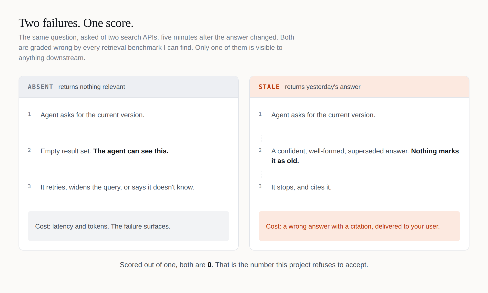
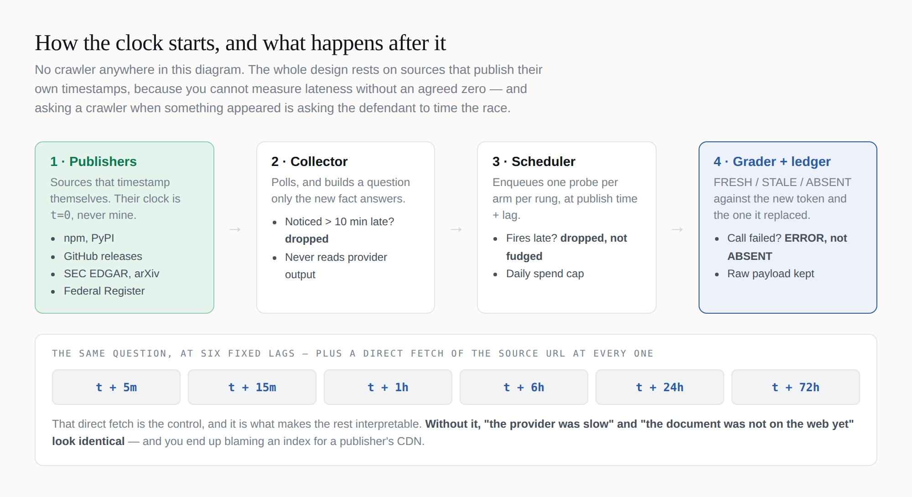
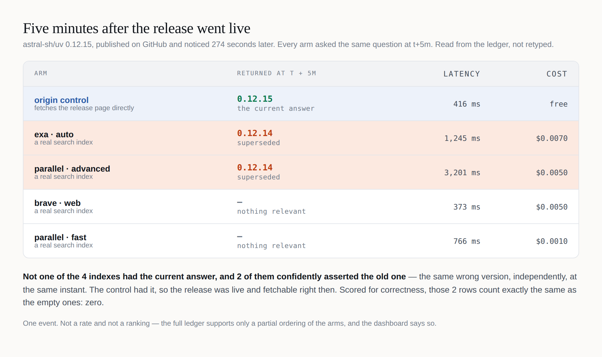
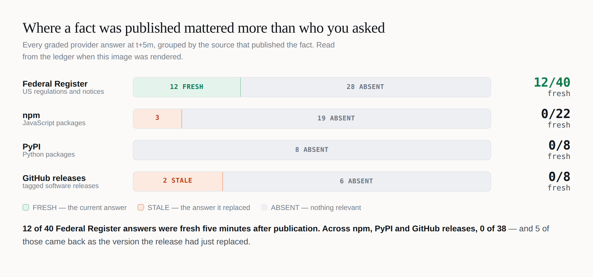

# Your agent searched the web. Did it get today's answer?

*Search benchmarks score an empty result and yesterday's answer the same way: zero. Only one of them makes your agent cite something false. I built a clock to tell them apart.*

---

When a fact becomes true on the web — a new package version, a new government notice — how long until a search API will hand it to an agent? And until it does, what does the API hand over instead?

I couldn't find a benchmark that answers the second question, so I built one. It has tracked 37 new facts so far, and the answer to the second question is the interesting one.

**[Try the playground →](https://abhid1234.github.io/time-to-index/playground.html)** — run the ladder, flip the scoring rule and watch the leaderboard change, then scroll down to every real probe from the ledger.

## Two failures, one score



**ABSENT** is a shrug. The API returns nothing useful, the agent can see that, and it retries, widens the query or says it doesn't know. It costs time and tokens, and the failure is visible.

**STALE** is a confident mistake. The API returns the answer that was true yesterday, well-formed and plausible. The agent has nothing to retry on, so it cites it.

Scored out of one, both are zero. In production, one gets noticed and the other one doesn't.

## A clock that starts on the publisher's time



Nothing here crawls the web. It watches places that timestamp their own publications — npm, PyPI, GitHub releases, the Federal Register — and uses that timestamp as t=0. You cannot measure lateness without an agreed zero, and asking a crawler when something appeared is asking the defendant to time the race.

Then it asks each search API a question only the new fact answers, at fixed lags after publication. At every lag it also fetches the source page directly. That control is what makes the rest readable: without it, "the index was slow" and "the page wasn't live yet" look identical.

The plan was pre-registered and hashed before the first probe, so the analysis can't drift toward a result I'd like.

## One row that shows the whole problem

`uv 0.12.15` was released on GitHub. Five minutes later, four search APIs were asked for the latest version.



The origin control had `0.12.15`, so the release was live and fetchable. Not one of the four indexes had it, and two of them — Exa and Parallel's advanced mode — independently answered `0.12.14`, the version it replaced. A conventional benchmark scores those two rows exactly like the empty ones.

## Where a fact is published mattered more than who you asked



Across 78 graded answers, every current answer came from the Federal Register: 12 of 40. New npm, PyPI and GitHub releases: 0 of 38, and five of those answers were the version that had just been replaced. That split is not close (Fisher exact p = 0.0002).

So "how fast is this search API?" is underspecified. Fast for what? A new US regulation was often findable within five minutes. A new version of a widely used package, never.

## Fast and stale are different axes

After correcting for six comparisons, the ledger supports two orderings: Parallel's advanced mode found new facts more often than Brave and than Exa. That claim is narrow — all nine of its current answers were Federal Register documents, and on package registries it was never current either. The other four pairs are underpowered, and the dashboard prints a partial ordering instead of a leaderboard.

The same arm is also tied with Exa for the most stale answers. It was the most likely to have the new fact and one of the two most likely to hand you the old one as current. A single score has to call that arm good or bad. It is both, and that is the point of measuring the two separately.

## What it can't claim yet

This is a small, early sample: 37 events over nearly four weeks, and every verdict is at the five-minute mark, because a GitHub Actions cron fires every few hours and later probes mostly miss their window. The origin control also fails on Federal Register pages — 10 of 10 — so the ABSENT verdicts there can't be checked against it. I haven't patched that, because changing how a control is graded after seeing results is exactly what pre-registration exists to stop. It's the first fix, in the open.

And while building a tool about not confusing "we didn't ask" with "the index didn't have it," I shipped that bug into my own dashboard three times — grey squares for probes never run, and totals that counted them. All three were in the presentation, not the measurement. The repo has the fixes and the tests that pin them.

## Reproduce it

Every number above is read from a ledger committed to the repo, with every raw API response alongside.

```bash
git clone https://github.com/abhid1234/time-to-index && cd time-to-index
pip install -e .
python -m tti verify     # offline: config, estimator, grader, ledger
python -m tti demo       # synthetic run, no keys, no spend
```

## Get it

- **Playground:** https://abhid1234.github.io/time-to-index/playground.html
- **Live dashboard:** https://abhid1234.github.io/time-to-index/
- **Code, ledger and method (MIT):** https://github.com/abhid1234/time-to-index
- **91-second video:** https://abhid1234.github.io/time-to-index/playground.html#film

If you work on one of these indexes and think the method is unfair to you, open an issue. The plan is pre-registered so that argument can be about the method rather than the result.
