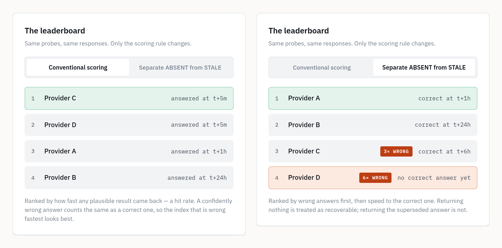

# Your agent searched the web. Did it get today's answer?

*A clock for every newly published fact — and a score that tells "found nothing" from "found yesterday's answer."*

---

Your agent asks a web-search API for the latest version of a package that shipped five minutes ago. The API answers instantly, cites a source, and gives the version that was just replaced. Nothing in the response says it's out of date, so your agent passes it along. Ask which search API would have had the new version — or how long any of them take to catch up — and there's no number to look at.

I built Time to Index to measure that. It's an open, pre-registered benchmark: it starts a clock the moment a fact is published, asks web-search APIs about it at fixed lags, and scores two failures separately — **ABSENT**, nothing useful came back, and **STALE**, the answer that was just replaced came back, confidently.

Three things it will never do, by design:

- **Never uses its own clock.** Time zero is the publisher's timestamp — npm, PyPI, GitHub releases, the Federal Register. Nothing is crawled.
- **Never scores a stale answer as a near-miss.** ABSENT and STALE are separate verdicts. A confident wrong answer is never averaged into "didn't find it."
- **Never ranks what it can't separate.** The analysis plan was hashed before the first probe, and the dashboard prints only the orderings that survive correction for multiple comparisons.


## Two failures, one score


ABSENT is visible. Your agent can see it got nothing, so it retries, widens the query, or says it doesn't know. STALE isn't. The answer is well-formed and cited, so your agent has nothing to retry on — it cites it, to your user.

Most benchmarks can't tell these apart. Score for correctness and both are zero. Score a hit rate — did something plausible come back — and the stale answer counts as a success. Either way, the failure that reaches your users disappears from the number.

Every answer is also checked against a direct fetch of the source page at the same moment. Without that control, "the index was slow" and "the page wasn't live yet" look identical.

## What 37 new facts showed

Four web-search APIs — Parallel (advanced and fast), Exa and Brave — asked five minutes after each fact went live: 78 graded answers, for about 35 cents.

**The clearest catch is one release.** uv 0.12.15 shipped on GitHub. Five minutes later the release page had it. Exa and Parallel's advanced mode both answered 0.12.14, the version it replaced. Brave and Parallel's fast mode returned nothing.


**Where a fact is published mattered more than who you asked.** New Federal Register notices came back current 12 times out of 40. New npm, PyPI and GitHub releases: 0 of 38, and 5 of those answers were the version that had just been replaced. That split is not close (Fisher p = 0.0002).


**Fast and stale are different axes.** After correcting for six comparisons, two orderings hold: Parallel's advanced mode found new facts more often than Brave and than Exa. All nine of Parallel's fresh answers were Federal Register notices — and it's tied with Exa for the most stale answers. A single score has to call that arm good or bad. It's both.

## Try it in your browser

The playground walks the whole argument in four steps: watch the clock start on a real npm release, run the ladder on four simulated indexes, flip the scoring rule, then scroll into the real ledger — every probe this project has run.

[abhid1234.github.io/time-to-index/playground.html](https://abhid1234.github.io/time-to-index/playground.html)

Step 3 is the one to try. Run the ladder, then switch from conventional scoring to "Separate ABSENT from STALE." Provider A, slow but never wrong, goes from third place to first. Provider D, instant and wrong every time, drops to last:



Prefer to watch? The 91-second version is at the top of the playground.

## Reproduce everything

No accounts, no keys, no spend. Five minutes:

```
$ git clone https://github.com/abhid1234/time-to-index && cd time-to-index
$ pip install -e .
$ python -m tti verify
$ python -m tti demo
```

`tti verify` re-checks the config, the estimator, the grader and every committed result, offline. `tti demo` runs a synthetic ladder with known answers and shows the estimator recovering them.

One thing to be clear about: this is a small, early sample. 37 events over four weeks, and every verdict is at the five-minute mark — a GitHub Actions cron fires every few hours, so later probes mostly miss their window. The origin control also can't read Federal Register pages (it failed 10 of 10), so the ABSENT verdicts there can't be checked against it. I haven't patched that, because changing how a control is graded after seeing results is exactly what pre-registration exists to stop. It's the first fix, in the open.

## Get it

- **Playground** — [abhid1234.github.io/time-to-index/playground.html](https://abhid1234.github.io/time-to-index/playground.html)
- **Live results** — [abhid1234.github.io/time-to-index](https://abhid1234.github.io/time-to-index/)
- **Code (MIT)** — [github.com/abhid1234/time-to-index](https://github.com/abhid1234/time-to-index) · 610 tests · Python 3.10–3.13 · two runtime dependencies
- **Release** — [v0.1.0](https://github.com/abhid1234/time-to-index/releases/tag/v0.1.0), wheel and source with SHA-256 sums
- **The ledger** — every event, probe and raw answer, committed alongside the code

Your agent already searches the web. Now you can tell when it's reading yesterday's answer.
